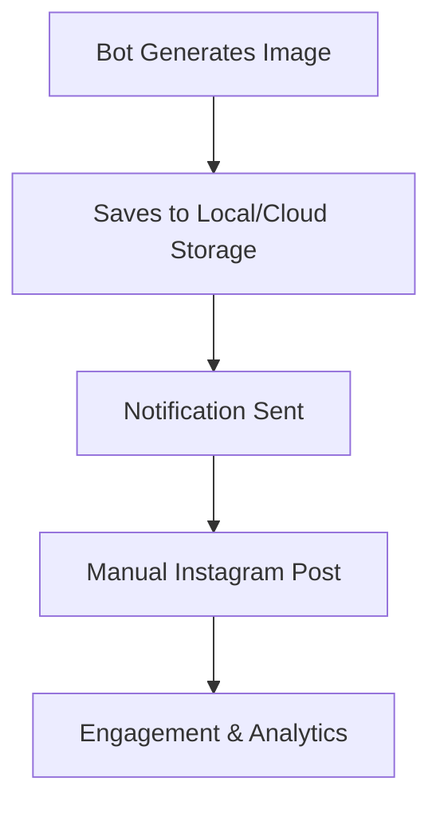

# Instagram API Reality Check 📱

## ⚠️ Important: Instagram Basic Display API Limitations

**Instagram Basic Display API is READ-ONLY!** It cannot post content to Instagram. Here's what you need to know:

### What Instagram Basic Display API CAN do:
- ✅ Read user profile info
- ✅ Get user's media (photos/videos)
- ✅ Get media metadata
- ❌ **CANNOT post new content**
- ❌ **CANNOT upload images**
- ❌ **CANNOT create stories**

### For Posting Content, You Need:

## 1. Instagram Graph API (Business/Creator Accounts)

This application is designed to use the Instagram Graph API for posting content.

### Requirements:
- ✅ Instagram Business or Creator account
- ✅ Connected Facebook Page
- ✅ Facebook App with Instagram Graph API
- ✅ App Review for some features
- ⚠️ Rate limits: 200 requests/hour per user

### What it CAN do:
- ✅ Post photos and videos
- ✅ Post stories
- ✅ Schedule content
- ✅ Get insights and analytics

### Setup Steps:
1. Convert Instagram account to Business/Creator
2. Create Facebook Page and connect to Instagram
3. Create Facebook App
4. Add Instagram Graph API product
5. Get access tokens
6. Submit for app review (if needed)

## 2. Storing Instagram Credentials

Your Instagram credentials (API key and account ID) are stored securely within the `data/characters.json` file for each character. This allows the application to manage multiple characters with different Instagram accounts.

**Example `character` object in `data/characters.json`:**

```json
{
  "id": "char_1754528276811_4suaz8mqv",
  "name": "Luna the Mystic",
  "instagramHandle": "@luna_mystic",
  "instagramAccountId": "1234567890",
  "instagramApiKey": "YOUR_INSTAGRAM_API_KEY",
  "...": "..."
}
```

This design ensures that each character's posting capabilities are tied to their specific profile.

## 3. Alternative Solutions

If you are unable to use the Instagram Graph API, here are some alternative solutions:

### A. Manual Posting (Most Reliable)
```
✅ Bot generates images
✅ Saves images locally
✅ You manually post to Instagram
✅ No API restrictions
✅ Better engagement control
```

### B. Third-Party Services
- **Buffer** - $5/month, supports Instagram posting
- **Hootsuite** - $49/month, full social media management
- **Later** - $18/month, visual content calendar
- **Creator Studio** - Free for business accounts

### C. Instagram Creator Studio (Free!)
- ✅ Free for business accounts
- ✅ Schedule posts
- ✅ Analytics included
- ✅ No API development needed

## 4. Recommended Zero-Cost Approach


